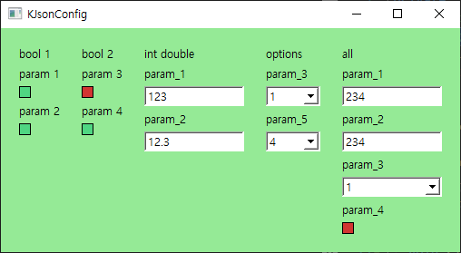

# KJsonConfig
Qt Widget managing json configuration file


## Usage

```cpp

int main(int argc, char** argv) {
  QApplication app(argc, argv);

  KJsonConfig widget_main;

  widget_main.setStyleSheet("\
			QWidget{background:rgb(149, 234, 150);}\
			QLineEdit{background:rgb(255, 255, 255);}\
			QComboBox{background:rgb(255, 255, 255);}\
      QCheckBox:indicator{background:rgb(210, 53, 50);border: 1px solid;}\
      QCheckBox:indicator:checked{background:rgb(79,214,130); border: 1px solid;}\
      \
      ");

  widget_main.Add("bool 1","../sample_bool.json");
  widget_main.Add("bool 2","../sample_bool2.json");
  widget_main.Add("int double","../sample_line_edit.json");
  widget_main.Add("options","../sample_combo.json");
  widget_main.Add("all", "../sample_1.json");
  widget_main.show();

  std::cout << widget_main["all"]["param_1"]["value"]<<std::endl;
  std::cout << widget_main["all"]["param_2"]["value"]<<std::endl;
  std::cout << widget_main["all"]["param_3"]["value"]<<std::endl;

  return app.exec();
}
```


 
